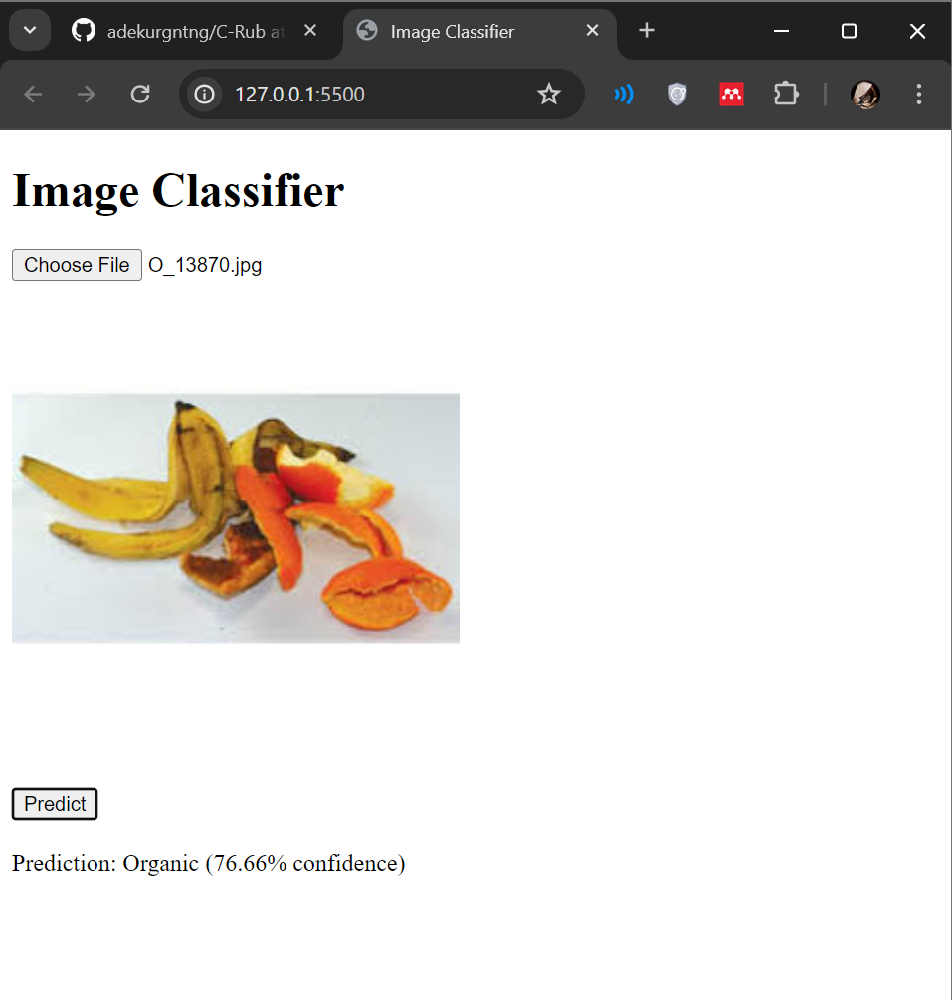
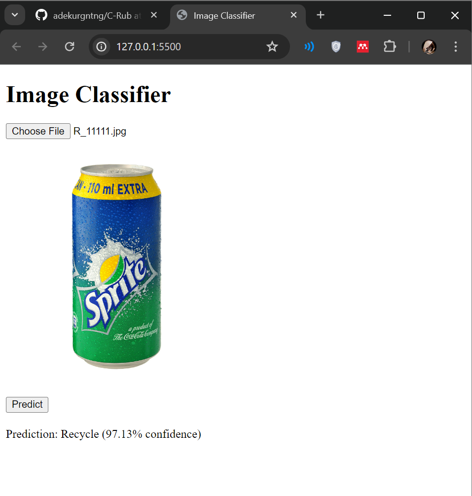

# C-Rub: Android App for Organic and Recycle Waste Classification using Machine Learning

Welcome to C-Rub, an Android application aimed at classifying waste into Organic and Recycle categories using machine learning models. This repository contains the necessary resources and documentation to understand and contribute to the project.

## Team Members ML
- **Ade Kurnia M367D4KY1810**
  - [GitHub](https://github.com/adekurgntng)
  - [LinkedIn](https://www.linkedin.com/in/ade-kurnia-97aaa829b/)

- **Nurcinta Asih M367D4KX2630**
  - [GitHub](https://github.com/)
  - [LinkedIn](https://www.linkedin.com/in/nurcinta-asih-107b752a5/)

- **Erwin Hardiansyah M118D4KY2426**
  - [GitHub](https://github.com/)
  - [LinkedIn](https://www.linkedin.com/in/)

## Project Overview
C-Rub leverages machine learning to help users identify whether waste items are suitable for organic decomposition or recycling. The Android app provides an intuitive interface for users to capture images of waste items, which are then processed using a pre-trained model.

## Directory Structure
- `C-Rub/images/`: Directory to store images for documentation purposes.
- `C-Rub/model/` : Stores the TensorFlow.js model and TensorFlow Lite model.
- `C-Rub/WebTest/`: Simple web-based test interface using the TensorFlow.js model.
  - `model/`: Contains the trained TensorFlow.js machine learning model.
  - `index.html`: HTML file for the web interface.
  - `script.js`: JavaScript file for handling interactions in the web interface.
- `C-Rub/NotebookFix.ipynb`: Google Colab notebooks used for model training.
- `C-Rub/README.md`: Documentation file (this file).

### Machine Learning Model (TensorFlow.js)
- The machine learning model is implemented in TensorFlow.js to classify waste images into Organic and Recycle categories efficiently on Android devices and web browsers.
- Check the `NotebookFix` directory for details on the model training process.

### Cloud Computing (CC)
- The project leverages Cloud Computing services for model deployment, ensuring scalability and efficient utilization of resources.

### Web Test Interface
- Open `index.html` in a web browser to test the model using images from your local system.
- Follow the instructions on the web page to upload an image and see the classification results.

#### Organic Waste Classification

#### Recycle Waste Classification

These screenshots demonstrate the effectiveness of the TensorFlow.js model in accurately classifying waste items into Organic and Recycle categories through the web interface.

---